# Bookable — demo script

Every command below was run once against a fresh database on 2026-09-23 (seed 20 s, build ~1 min, all 19 staff routes answered 200 after sign-in, the running-late scene was set and cleared live). Anything you see on screen that differs from this file, the file is wrong — fix it.

**What this is:** appointment scheduling for a sample 4-chair salon, "Shear Genius" (Dana, Priya, Marcus, Tess). Time zone America/Chicago. Everything is synthetic.

## Setup (once, ~2 min)

Run from the repo root. A fresh database keeps the demo book separate from `bookable_dev` and `bookable_test`.

```bash
createdb bookable_demo
export DATABASE_URL="postgresql://<user>@localhost:5432/bookable_demo?connection_limit=10&pool_timeout=20"
export DIRECT_URL="$DATABASE_URL"

npm run migrate:deploy -w packages/db                      # all migrations, from scratch
npx dotenv -e .env.local -- npx tsx packages/db/seed.ts    # the book (prints a [seed] summary line)
npx dotenv -e .env.local -- npx tsx -e "
import { PrismaClient } from './packages/db/generated/client/index.js';
import { seedStaffUser } from './packages/db/auth/seed-staff';
(async()=>{const p=new PrismaClient();console.log(await seedStaffUser(p,{email:'owner@shear-genius.test',password:'demo-owner-password'}));await p.\$disconnect()})()"

npx dotenv -e .env.local -- npm run build -w apps/web      # production build, like CI
npx dotenv -e .env.local -- npm run start -w apps/web      # serves on :3300
```

`<user>` is whatever your local `DATABASE_URL` in `.env.test` uses (`grep DATABASE_URL .env.test`). Exporting `DATABASE_URL` first matters: `dotenv` never overrides a variable that is already set, so this is what points the app at `bookable_demo` and not `bookable_dev`.

**The seed prints** `4 providers, 8 services, ~719 appointments, 13 clients … 3 on the waitlist … 1 double-booked by override`. If the waitlist or override counts are 0, the seed did not run in full — re-create the database.

### Accounts and where each credential lives

| What | Value | Lives in |
|---|---|---|
| Staff sign-in (owner) | `owner@shear-genius.test` / `demo-owner-password` | Created by the `seedStaffUser` command above. The seed script itself creates **no** login. The helper refuses to run under `NODE_ENV=production`, which is why a known password is acceptable. |
| Session signing key | `SESSION_SECRET` | `.env.local` (app refuses to handle sessions without it) |
| Reminder-job bearer | `CRON_SECRET` | `.env.local` |
| Clients | no accounts — public booking and `/manage/<token>` links | — |

Check the env vars exist before you start: `grep -c '^SESSION_SECRET=' .env.local` and `grep -c '^CRON_SECRET=' .env.local` must each print `1`.

## The walk (about 12 minutes)

The book is anchored to fixed dates for the DST cases (spring-forward 2026-03-08, fall-back 2026-11-01) and to *today* for the live week, so the day view is always populated.

### 1. The public site — `http://localhost:3300/`
Pages: `/`, `/services`, `/stylists`, `/visit`, `/book`. **Say:** a client picks a service and is offered real times from the same engine the desk uses. Slot identity is the *instant*, never a `{date, time}` pair — on the fall-back day "01:30" names two moments.


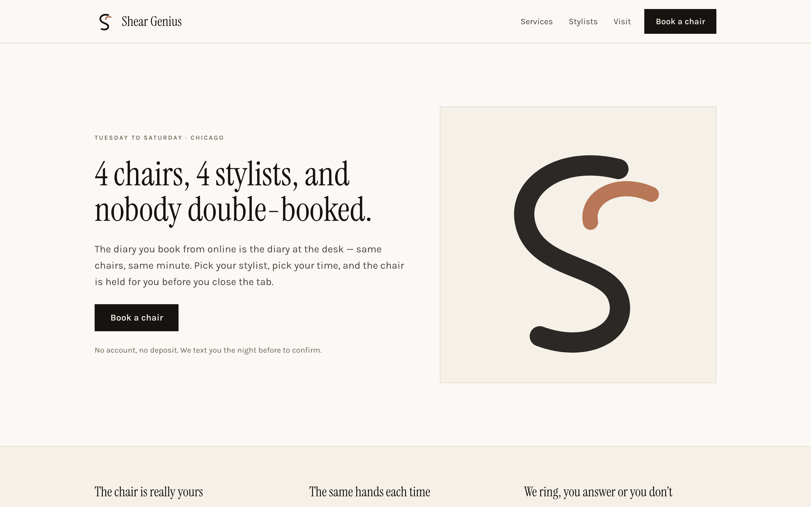
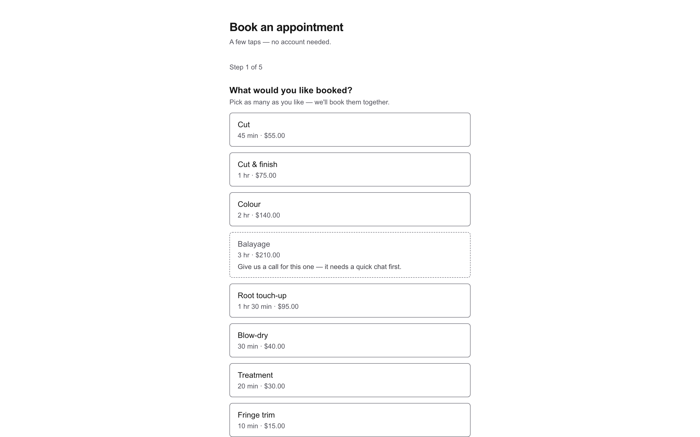
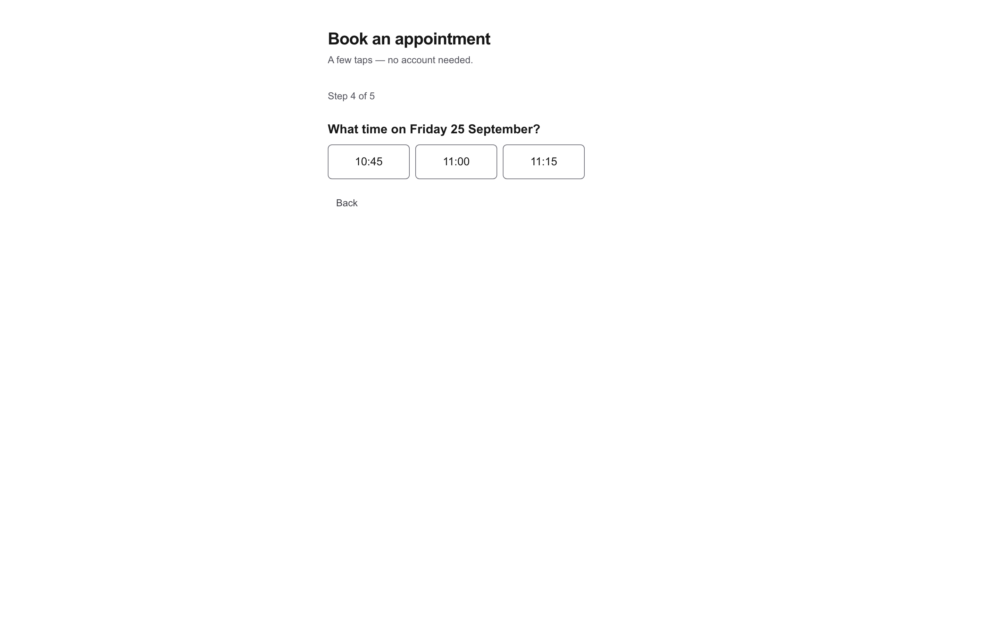

### 2. Sign in — `/staff/login`
Use the owner account. Lands on `/staff/day`, today's grid: four columns, one chip per appointment (about 40 today).


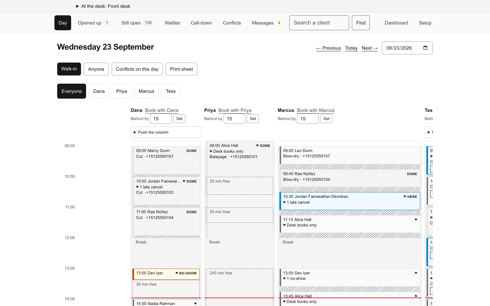

### 3. The day grid — `/staff/day`, then `?day=2026-09-24` (Thursday)
Thursday is the dense day. Point at:
- **Tom Byrne, 10:00** — `⚑ Allergic to PPD — patch test before any colour.` The note travels with the client onto every chip.
- **Dev Iyer, 09:00** — `⚑ OVR` / `OVERRIDE`: a double-booking the desk chose on purpose, drawn in its own lane beside Leo Dunn. The database constraint is never lied to (a zero-width blocked range plus the remembered original), and the grid still shows the true collision.
- **Nadia Rahman, 11:00 / Jordan Fairweather-Okonkwo, 09:00 (Tess)** — `⚑ 1 late cancel`. Dev Iyer also carries `⚑ 1 no-show`. **Say:** the flag is the half the desk acts on, and a test compares `scrollWidth` with `clientWidth` because a clipped line passes every other assertion.


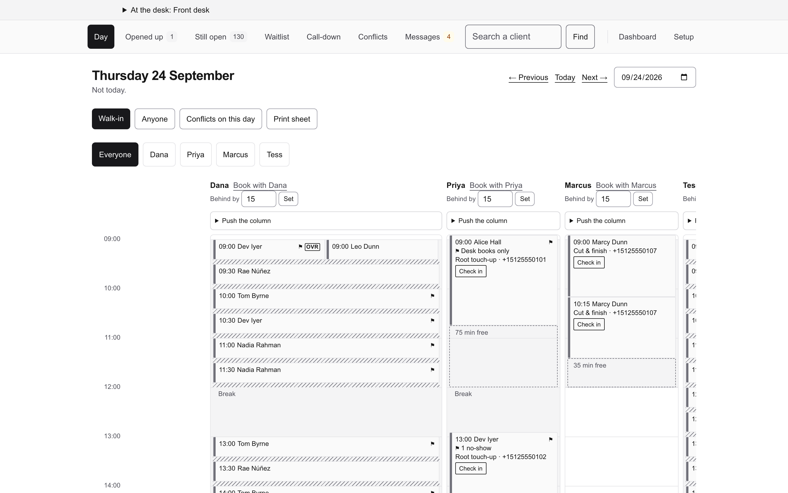
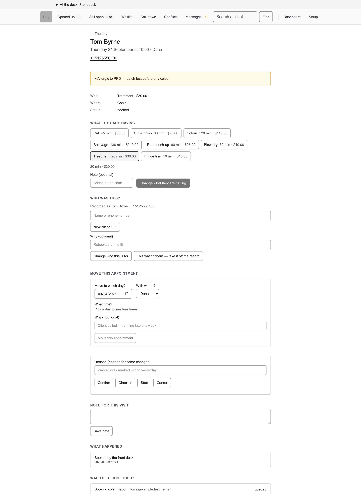

### 4. Running late — today's `/staff/day`, Dana's column
Type `15` into **Behind by** and press **Set**. Dana's later chips read `→ 14:15`-style projections, and the panel says *"Nobody has been messaged. Setting the delta changes no times and sends nothing."* Press **Back on time** to clear it. **Say:** a delta is a named claim, not a stored per-client delay; one derivation feeds the chip, the name and the ring-round, so they cannot disagree. Times only move when the desk taps **Push the column**.

*Needs Dana to have appointments later today. After ~17:00 the panel has nothing to project — use a weekday morning.*


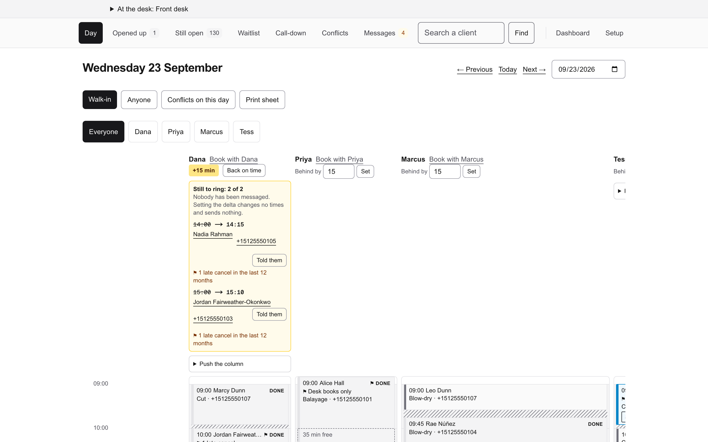

### 5. What's opened up — `/staff/opened`
Freed time (cancelled, shortened, moved), soonest-to-expire first, each with **Who wants this slot?** Points at *"Dev Iyer never came — the rest of the time was put back"* and Alice Hall's cancelled Blow-dry. The matcher measures the whole footprint (buffers included), so it only offers people the gap actually fits.


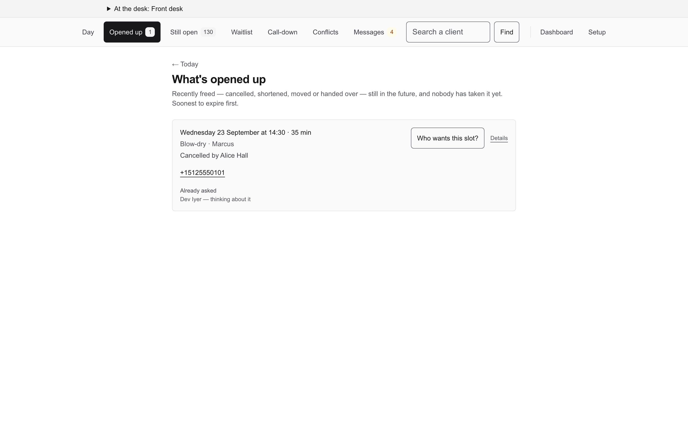

### 6. Waitlist — `/staff/waitlist`
Dev Iyer, Nadia Rahman, Tom Byrne waiting, with acceptable providers, date window, days and time of day.


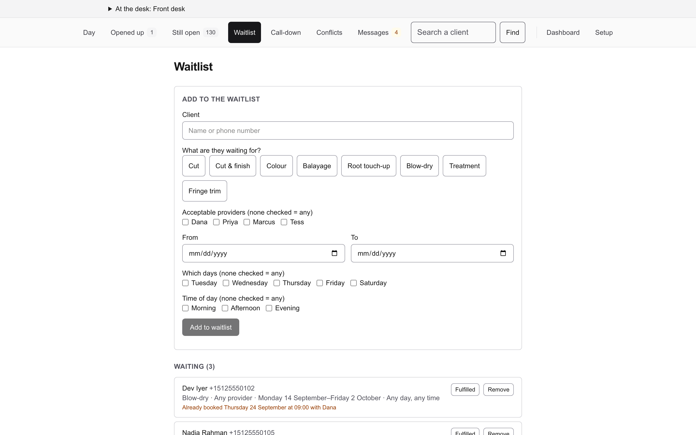

### 7. Call-down — `/staff/call-down`
Tomorrow's unconfirmed bookings (34 of 36 still to ring). Buttons: **No answer / Left a message / Confirmed**. **Say:** marking a call sends nothing; it records that a person picked up the phone. A no-show tomorrow is nobody's default.


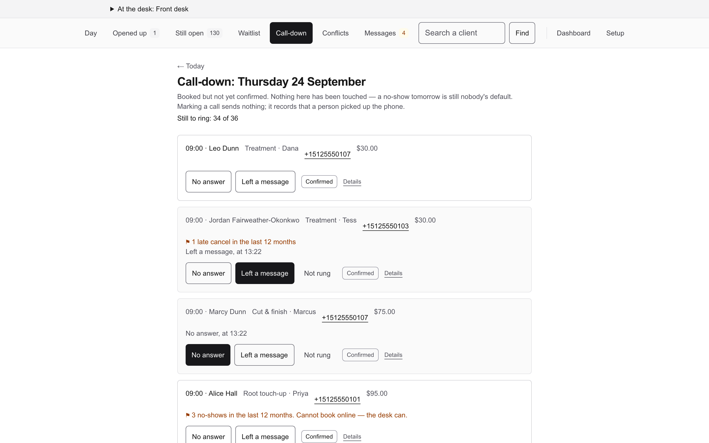

### 8. Still open — `/staff/unfinished`
128 past appointments nobody closed out, with **Came / Didn't come** and the dollar figure the week's numbers cannot see.


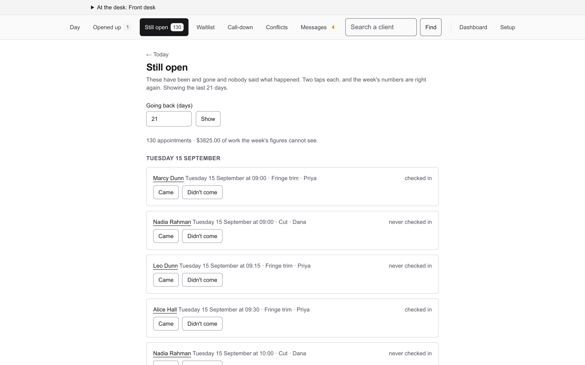

### 9. Dashboard — `/staff/dashboard`
Bookings, cancellations, no-shows by provider, worked vs booked utilization. Drill-downs: `/staff/dashboard/lapsed` (clients who stopped coming — who to ring to fill a quiet Tuesday) and `/staff/dashboard/overruled`.


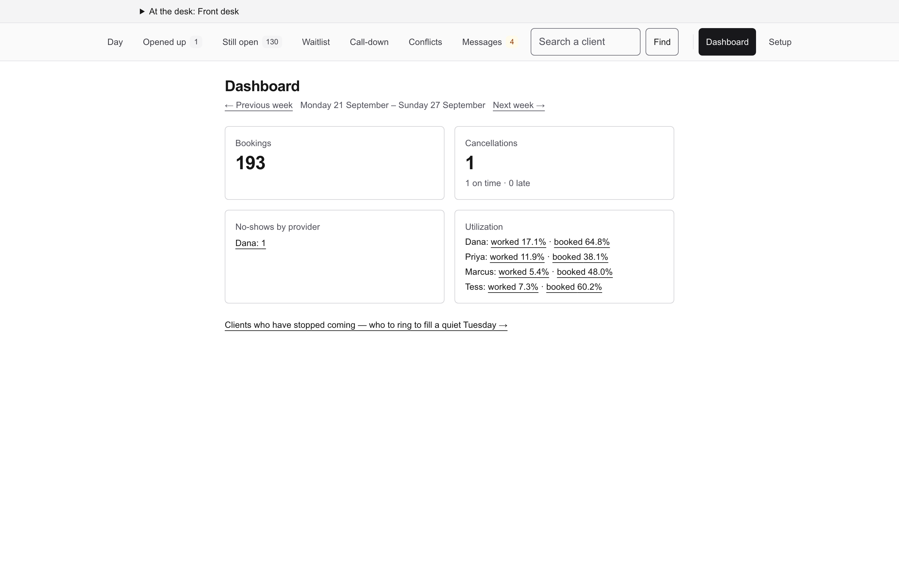
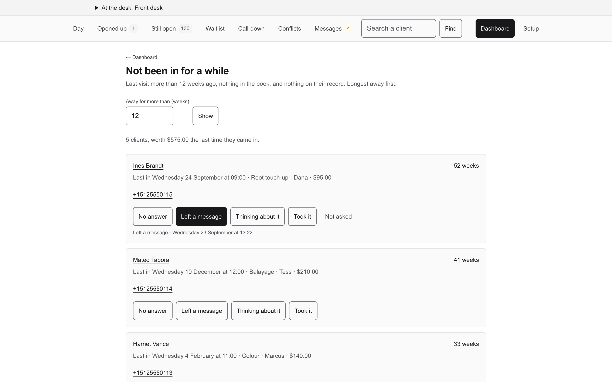

### 10. The reminder job — from a terminal
```bash
C=$(grep '^CRON_SECRET=' .env.local | cut -d= -f2-)
curl -s -H "Authorization: Bearer $C" localhost:3300/api/jobs/reminders   # 200, JSON counts
curl -s -o /dev/null -w '%{http_code}\n' localhost:3300/api/jobs/reminders  # 401 without the secret
```
Returns `{"reminders":{"due":…},"dispatch":{…}}`. **Say:** the route refuses to run open, same reasoning as `SESSION_SECRET`.

### 11. The rules underneath (optional, if the audience is technical)
- `docs/prds/07-decisions.md` overrides the PRDs; nothing settled is re-opened.
- The no-overlap invariant is a Postgres exclusion constraint (SQLSTATE `23P01`), not application code.
- CI runs the suite under `TZ=UTC` and `TZ=Pacific/Kiritimati` and expects identical results.

## Screenshots

Thirteen shots in `docs/screenshots/`, taken from this same seeded book at 1440×900 (@2x, light scheme). To retake them after a re-seed, with the server up:

```bash
node docs/screenshots/capture.mjs docs/screenshots
```

Against the hosted copy: `BASE=https://appt.labintelligence.co DEMO_ACCESS_PASSWORD=… node docs/screenshots/capture.mjs docs/screenshots`. The running-late shot sets a delta on Dana and clears it again afterwards, so a second run starts from the same book. The dates in the shots are whatever "today" was when the book was seeded.

## Troubleshooting

| Symptom | Cause | Fix |
|---|---|---|
| Sign-in fails with the right password | No staff row — the seed does not create one | Run the `seedStaffUser` command in Setup |
| Day grid is empty or shows another book | `DATABASE_URL` was not exported before `dotenv`, so `.env.local` (`bookable_dev`) won | Stop, export the variables, restart |
| Waitlist / override / call marks all zero | Seed did not finish (`P2028` timeout on a loaded machine) | Check `sysctl -n vm.loadavg`; kill orphaned vitest workers; `dropdb bookable_demo && createdb bookable_demo` and redo Setup |
| Every page 500s after the repo directory moved | Old absolute path baked into `apps/web/.next` | `rm -rf apps/web/.next && npm run db:generate`, rebuild |
| `EADDRINUSE :3300` | A previous server is still up | `lsof -ti :3300 \| xargs kill` |
| Running-late panel shows nothing to project | Dana has no appointments later today | Demo on a weekday before ~17:00 |
| Walk-in refused for ~15 min after a claim is cleared | See concession 2 below | Tap **Back on time** |
| Tess's column is cut off on a laptop screen | The grid scrolls sideways inside its own box, and the page itself doesn't | Scroll the grid, or pick one stylist with the filter buttons |
| `zsh: no matches found` on a URL | zsh globs `?` | Quote the URL |

## Concede before you're asked

1. **SMS is a log line.** The notification adapter is the console adapter; nothing leaves the machine. The outbox and dispatcher are real; the provider is not wired.
2. **A spent running-late claim still blocks the engine.** After a claim is spent, the engine keeps refusing the next `delta` minutes (its interval runs from `now`). A walk-in cannot be offered to an idle stylist until the desk taps **Back on time** — one tap, and the refusal names `running-late`. Settled as D-22.
3. **A pushed client who becomes the head after a claim made with an empty chair over-reads.** Measured: +40 delta, push +15, Bea checked in — Bea's chip reads +40 against a true 25 and Cat reads 25 against a true 20. The cap (D-62) bounds it and the client is already in the building.
4. **A colour seated before a gap client's post-claim checkout reads capped at the delta** (A-135's own leave-behind).
5. **A forgotten earlier `checked_in` client, with the real one never tapped in, can head the chain.** Needs two lapses (A-132).
6. **The engine interval and the column badge both read the *reduced* delta** (A-133; D-22, D-43).
7. **A gap client's block is not checked against a colour's projected second block** — needs a delta larger than the gap; bounded by D-62 (A-134).
8. **Waitlist matching is oldest-first**, and **D-54 widens a column on heavy cancellation days.** Both open since Phase 15; not built.
9. **Deliberately not built:** holds, automated offers (OQ-4), a staleness alarm, a per-client stored delay.
10. **Not deployed.** Local only; there is no production database, no real client data, and every name, phone number and dollar figure is synthetic.
11. **Reminders:** two of the seeded reminders are left by the skipped band on purpose — the never-reminded screen is not empty on a fresh install.

## Reset

```bash
pkill -f "next start -p 3300"; lsof -ti :3300 | xargs -r kill
dropdb bookable_demo && createdb bookable_demo   # then redo Setup
```
`bookable_demo` is safe to drop. Never drop `bookable_dev`, `bookable_test`, `bookable_cisim`, `bookable_shadow` or `bookable_drift_shadow`.
